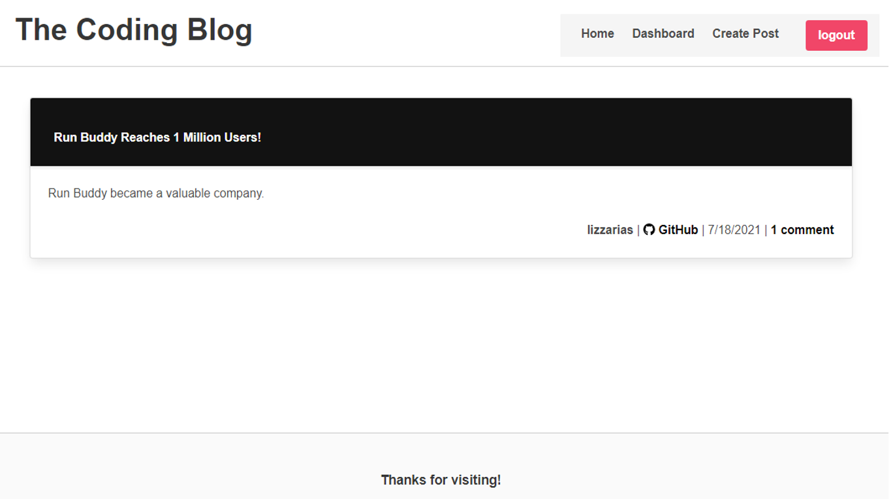

# The-coding-blog

## Description
A CMS-style blog where developers can publish their blog posts and comment on other developers’ posts as well.

  ## Table of Contents

* [Installation](#installation)
* [Deployment](#deployment)
* [License](#license)
* [Questions](#questions)
* [Mock-up](#mock-up)


## Installation 
The user needs to have Node.js installed. Clone the repo, run `npm i` for the dependencies. After that, create an .env file and add your database name, MySQL username, and MySQL password as follows:

 ```DB_NAME='just_tech_news_db'
 DB_USER='your_mysql_user'
 DB_PW='your_mysql_pw'
 SESSION_SECRET='your_secret'
 ```

 Open MySQL shell and create the database typing source `db/schema.sql` and `quit`to exit the shell.
 Create a `.gitignore` file and add the following files:

 ```node_modules 
 .DS_Store
 .env
 ```

To start the application, run:
`npm start`. 

## Deployment
Find the deployed website [here]().


## License


## Questions
If you have any questions about this project, send me an email at lizethariasc14@gmail.com or contact me through my [GitHub](https://github.com/lizariasc).

## Mock-up
